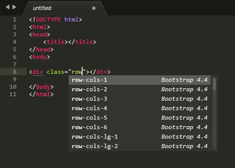

# Bootstrap 4.4 Autocomplete - Sublime Text 3

#### A sublime plugin complete with Bootstrap 4.4 Autocomplete
###### 👉 Bootstrap 4.4 - Sublime Autocomplete - *(Currently Bootstrap v4.4.1)*
---

If any classes left out in this plugin, please let us know via:

| :globe_with_meridians: 	| [proficientdesigners.com](https://proficientdesigners.com/) |
| :------ 					| :-----  |
| :octocat: 				| [Issues](https://github.com/proficientdesigners/sublime-text-bs4-autocomplete/issues) |

## Screenshot

## Installation
There are 3 methods for installing this plugin.

1. Search for "Bootstrap 4.4 Autocomplete" via the "Package Control: Install Packages" menu.
**Note:** If you don't have Sublime Package Control installed, you can find out how to install it here [https://sublime.wbond.net/installation](https://sublime.wbond.net/installation)

2. Clone the repository into your Sublime Text 3 packages directory.
`git clone https://github.com/proficientdesigners/sublime-text-bs4-autocomplete.git`

3. Download the .zip file and unzip it into your Sublime Text 3 packages directory.
**Note:** You can find your Sublime Text 3 packages directory by going to Preferences > Browse Packages.

## Created & maintained by

	

## License

Bootstrap 4.4 Autocomplete - Sublime Plugin is open-sourced software licensed under the [GPL license](https://www.gnu.org/licenses/gpl-3.0.en.html).
